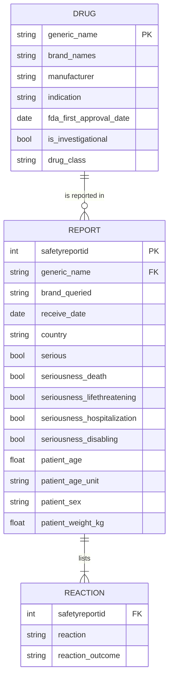
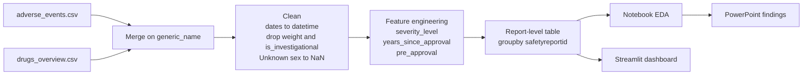

# GLP-1 Adverse-Event EDA & Safety Dashboard

## Table of Contents

- [Overview](#overview)
- [Project Structure](#project-structure)
- [Data Schema](#data-schema)
- [Data Pipeline](#data-pipeline)
- [Dashboard Pages](#dashboard-pages)
- [Key Findings](#key-findings)
- [Getting Started](#getting-started)
- [Requirements](#requirements)

## Overview

This project explores **adverse-event reports for GLP-1 receptor agonist drugs**, a drug class used to treat type 2 diabetes and obesity (Ozempic, Wegovy, Mounjaro, Trulicity and others). The dataset contains **149,209 reaction records** from **54,170 safety reports**, covering 7 drugs, 12 brands, 5 manufacturers and 73 countries.

Once a drug is on the market, spontaneous safety reports are the main real-world source of information about its side effects. The analysis looks at how serious the reported events are, who the patients are, which reactions are reported most, how brands compare, where reports come from, and which reports were received before the drug's FDA approval.

The project has two layers:

1. **A Jupyter notebook** (`code.ipynb`) that loads, cleans and analyses the data, building one-row-per-report tables so that each report is counted once.
2. **A Streamlit dashboard** (`app_simple.py`) that presents the KPIs and analyses interactively, with a brand filter.

## Project Structure

```
glp1-adverse-events/
├── code.ipynb                           # Notebook: loading, cleaning, feature engineering, EDA
├── app_simple.py                        # Streamlit dashboard: KPIs, brand filter, one tab per analysis
├── requirements.txt                     # Python dependencies
├── adverse_events.csv                   # Data: one row per reported reaction
├── drugs_overview.csv                   # Data: one row per drug (manufacturer, indication, approval date)
├── GLP1_Adverse_Events_Analysis.pptx    # Presentation of the findings
└── README.md
```

## Data Schema

Each **safety report** concerns one drug and can list **several reactions**. The raw file stores one row per reaction, so the same report appears on several rows.



### Column reference

| Column | Type | Description |
|---|---|---|
| `safetyreportid` | int | Unique identifier of the safety report |
| `generic_name` | string | Generic (molecule) name, e.g. semaglutide; key used to merge the two files |
| `brand_queried` | string | Brand name the report refers to, e.g. OZEMPIC |
| `receive_date` | date | Date the report was received |
| `country` | string | Country of the report (`UNK` = not recorded) |
| `serious` | bool | Report classified as serious |
| `seriousness_death` | bool | Event resulted in death |
| `seriousness_lifethreatening` | bool | Event was life-threatening |
| `seriousness_hospitalization` | bool | Event caused or prolonged hospitalization |
| `seriousness_disabling` | bool | Event caused disability or incapacity |
| `patient_age` | float | Patient age (missing in 43% of reports) |
| `patient_age_unit` | string | Unit of the age value |
| `patient_sex` | string | Female, Male or Unknown |
| `patient_weight_kg` | float | Patient weight in kg (missing in 81% of reports; **dropped**) |
| `reaction` | string | Reported adverse reaction (4,604 distinct terms) |
| `reaction_outcome` | string | Outcome of the reaction (61% "Unknown") |
| `brand_names` | string | All brand names of the drug |
| `manufacturer` | string | Company that makes the drug |
| `indication` | string | `type-2-diabetes` or `type-2-diabetes/obesity` |
| `fda_first_approval_date` | date | First FDA approval of the molecule (not of each brand) |
| `is_investigational` | bool | Always `False` (**dropped**) |
| `drug_class` | string | Pharmacological class |

### Engineered features

| Column | Type | Description |
|---|---|---|
| `approval_year` | int | Year of first FDA approval |
| `years_since_approval` | int | Whole years from approval to report date, rounded down with `np.floor` (negative = before approval) |
| `pre_approval` | bool | Report received before the FDA approval date |
| `severity_level` | int | Most serious outcome: 0 = none specified, 1 = disabling, 2 = hospitalization, 3 = life-threatening, 4 = death |
| `severity_label` | string | Text label of `severity_level` |

## Data Pipeline



**Cleaning decisions**

| Problem | Decision |
|---|---|
| 149,209 rows but only 54,170 reports (one row per reaction) | Aggregated with `groupby("safetyreportid")` so each report is counted once |
| Age missing in 43% of reports | Kept as missing. `KNNImputer` on one column fills every gap with the mean, creating a fake spike |
| Weight missing in 81% of reports, values up to 87,075 kg | Column dropped |
| Sex "Unknown" in 6% of reports | Excluded from sex comparisons |
| `is_investigational` always `False` | Column dropped |
| `.astype(int)` hid reports from the year just before approval | Replaced with `np.floor`, plus a date-based `pre_approval` flag |

## Dashboard Pages

| Page | Purpose |
|---|---|
| KPIs (top of page) | Total reports, % hospitalization or worse, % death, median age, % female, most common reaction |
| Severity | Number of reports in each severity level |
| Age & Sex | Age distribution by severity; mean age by sex and severity |
| Brands | Severity distribution (%) and most common reaction for each brand |
| Countries | Top 5 reporting countries |
| Reactions | Most common reaction and the top 10 reactions |
| Before FDA Approval | Reports received before approval, by brand and number of years before |

A sidebar filter lets you choose which brands to include; every KPI and chart updates to match.

## Key Findings

| KPI | Value |
|---|---|
| Safety reports | 54,170 |
| Hospitalization or worse | 13.2% |
| Death | 2.4% (1,293 reports) |
| Female (known sex) | 67.5% |
| Most common reaction | Nausea (7,629 reports, ≈14%) |
| Reports from the US | 87.5% |
| Reports before FDA approval | 153 (76% tirzepatide) |

- **Most reports are not serious**, but about 1 in 8 involved hospitalization, a life-threatening event or death.
- **Gastrointestinal effects dominate** (nausea, vomiting, diarrhoea, decreased appetite), which fits how GLP-1 drugs act.
- **4 of the top 10 reactions are about how the drug is used:** incorrect dose, injection site pain, device use error and off-label use. This points to patient training and pen design.
- **Reports are US-centred and mostly about women.** This may reflect who uses and reports these drugs. It does not show higher risk.
- **153 reports arrived before FDA approval**, up to 7 years before, mostly for tirzepatide, so they are likely clinical-trial reports.

**Limitations:** the data has no denominator (number of patients treated), so counts show reporting, not risk. Voluntary reports do not prove cause and effect. Approval dates are per molecule, not per brand.

## Getting Started

```bash
# 1. Install dependencies
pip install -r requirements.txt

# 2. Run the analysis notebook
jupyter notebook code.ipynb        # then Kernel → Restart & Run All

# 3. Launch the dashboard (opens at http://localhost:8501)
streamlit run app_simple.py
```

## Requirements

See [requirements.txt](requirements.txt). Core dependencies: `streamlit`, `pandas`, `numpy`, `plotly`. The notebook also uses `jupyter`.

Data source: FDA Adverse Event Reporting System (FAERS) via openFDA.
